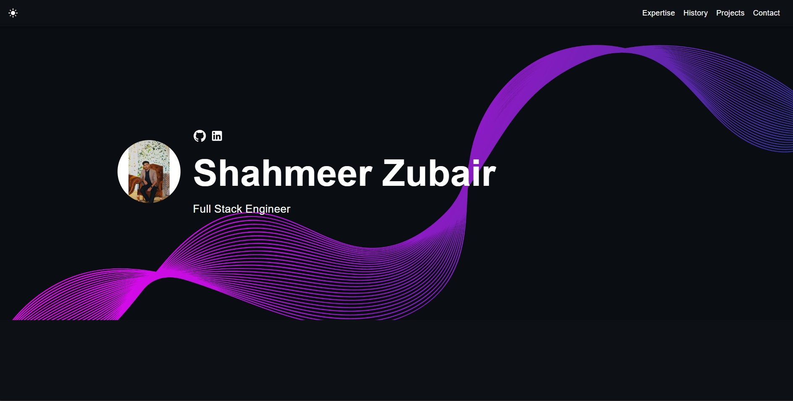

# Shahmeer Zubair — Developer Portfolio 🚀

        

## About

This is my personal developer portfolio, built to showcase my professional experience, technical skills, and projects. I'm a Full Stack / Frontend Developer working primarily with **React.js, Next.js, Node.js/Express, and ASP.NET Core**, with hands-on experience across the MERN stack and .NET-backed applications.

🔗 **Live site:** [shahmir.vercel.app](https://shahmir.vercel.app)
🔗 **LinkedIn:** [Shahmeer Zubair](https://www.linkedin.com/in/shameer-zubair/)
🔗 **GitHub:** [shamirzubair](https://github.com/shamirzubair)



## Tech Stack

**Frontend:** React.js, Next.js, JavaScript, TypeScript, HTML, CSS, Bootstrap, Tailwind CSS, jQuery, SCSS
**Backend & Databases:** Node.js, Express.js, .NET, MongoDB, PostgreSQL, MySQL, Firebase, RESTful APIs
**State Management:** Redux Toolkit, Context API, Zustand
**Tools:** Postman, Figma, pgAdmin, Android Studio, Axios, Chart.js, React Hook Form

## Featured Projects

- **[Vendix](https://pilot.vendix.com.sa/)** — Salon SaaS platform for the Saudi market (ASP.NET Core MVC, Razor, vanilla JS). Owner dashboard, KPI cards, Chart.js analytics, dark/light theme system, POS checkout, ZATCA e-invoicing admin panel.
- **[BizProbe](https://bizprobe.com/)** — Business review platform. Dynamic Reviews page, homepage recent-reviews section, hero search UI with tab filtering.
- **[EmployerNext](https://employernext.com)** — Global job search platform. Navbar, hero upload validation, scroll-behavior fixes.
- **[Falak Software](https://falaksoftware.com)** — Software agency site. Hero, services carousel, testimonials slider, portfolio section.
- **[ScamSoldier](https://scamsoldier.com)** — Essay writing service review platform (.NET backend, vanilla JS frontend).
- **[TripPlannerPK](https://tripplannerpk.com)** — Pakistan travel booking platform for flights, hotels, visas, and Hajj & Umrah packages (PHP backend, React.js frontend).
- **[Jamia Sohan](https://jamiasohan.org/)** — Islamic seminary platform with Arabic/Urdu localization, custom Traditional Arabic fonts, and RTL layout.
- **[Expense Tracker](https://expense-tracker-front-end-seven.vercel.app)** — Personal full-stack MERN project (React.js + Node.js/MongoDB), deployed on Vercel.
- **ShahmirBot** — Gemini-powered AI chatbot with SSE streaming and JWT-based auth, built with the MERN stack.

## Features

✅ Responsive design & mobile-friendly
✅ Dark and light mode support
✅ Highly customizable multi-component layout
✅ Built with modern technologies (React, TypeScript, JavaScript, and SCSS)

## Quick Setup

1. Ensure you have [Node.js](https://nodejs.org/) installed. Check your installation by running:

    ```bash
    node -v
    ```

2. In the project directory, install dependencies:

    ```bash
    npm install
    ```

3. Start the development server:

    ```bash
    npm start
    ```

4. Open [http://localhost:3000](http://localhost:3000) to view the app in the browser.

5. Customize the template by navigating to the `/src/components` directory. Modify texts, pictures, and other information as needed.

The page will reload if you make edits, and you will see any lint errors in the console.

## Deployment

This portfolio is deployed on [Vercel](https://vercel.com/). To deploy your own copy:

1. Push your project to a GitHub repository.
2. Import the repository into Vercel.
3. Vercel will auto-detect the build settings and deploy on every push to `main`.

Alternatively, you can deploy to [Netlify](https://www.netlify.com/), [Render](https://render.com/), or GitHub Pages.

## Contact

Got a project in mind? Feel free to reach out via the contact form on the [live site](https://shahmir.vercel.app), or connect with me on [LinkedIn](https://www.linkedin.com/in/shameer-zubair/).